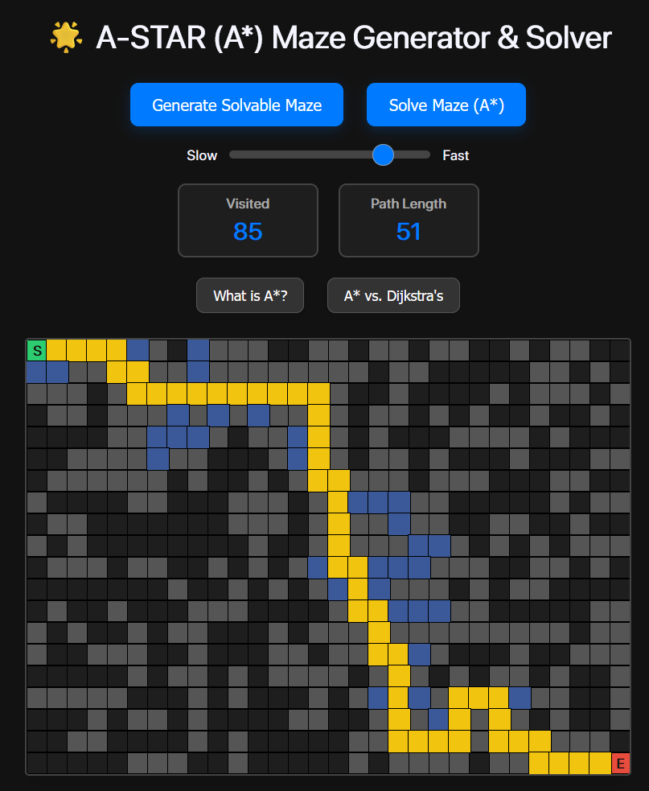

This project is an interactive, web-based application built with HTML, CSS, and JavaScript that visualizes the A* (A-Star) pathfinding algorithm. It allows users to generate a random, solvable maze on a 2D grid and then watch the algorithm find the shortest path from a start node to an end node.

The core of the project is a highly efficient A* implementation that uses a Priority Queue (Min-Heap) to achieve $O(N \log N)$ time complexity, a significant optimization over a simple array-based approach.

✨ Key Features:

🚀 A Algorithm:* Efficiently finds and displays the shortest path using the Manhattan Distance as its heuristic.

🎲 Dynamic Maze Generation: Users can generate new, random mazes with a 30% wall probability, which are guaranteed to be solvable using a Breadth-First Search (BFS) check.

🎥 Step-by-Step Visualization: The algorithm's process is animated, showing "visited" nodes (blue) and the final "path" (yellow) with a customizable delay.

🎛️ User Interface Controls:

🐢...🐇 Speed Slider: Allows the user to speed up or slow down the visualization.

☀️/🌙 Theme Toggle: A persistent light/dark mode switch.

Main Controls: Buttons to generate a new maze and to solve the current one.

📊 Real-time Analytics: Two panels display the total number of "Visited" nodes and the final "Path Length" after a solution is found.

🎓 Educational Panels: Collapsible info-boxes explain:

What the A* algorithm is.

The key differences between A* and Dijkstra's algorithm.

## Authors

- [@Siddhartha Gupta](https://github.com/sid-skippy)
- [@Abhishek Paul](https://github.com/abhishek9paul)

